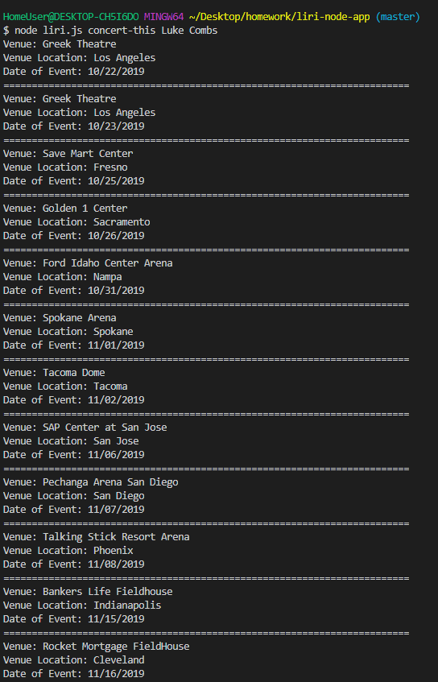
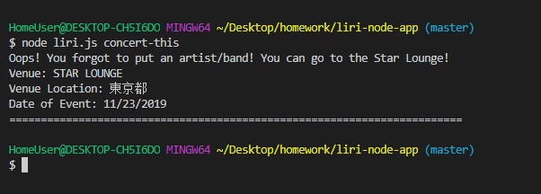
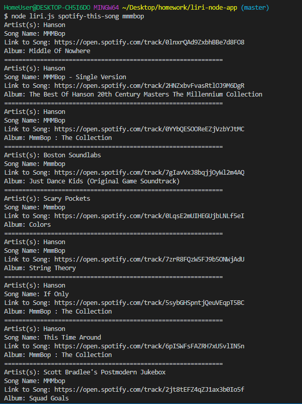
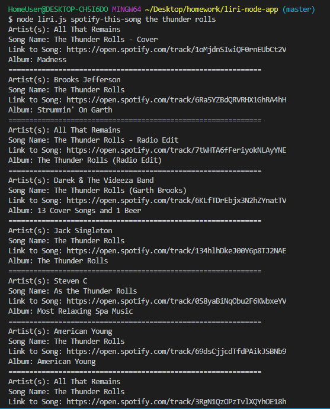
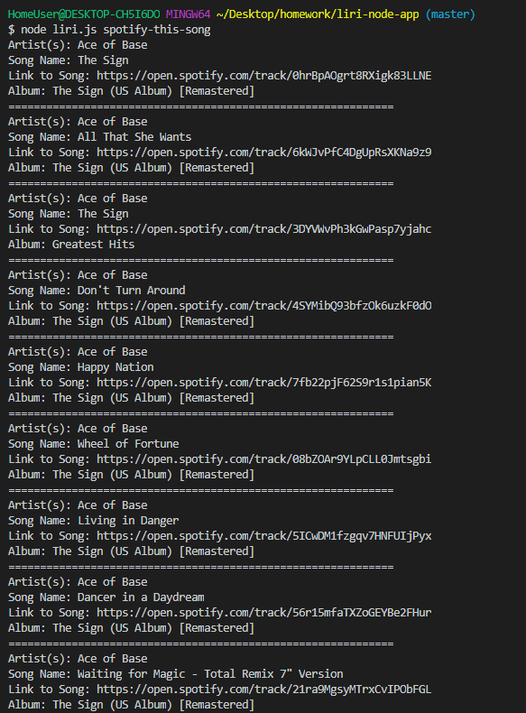
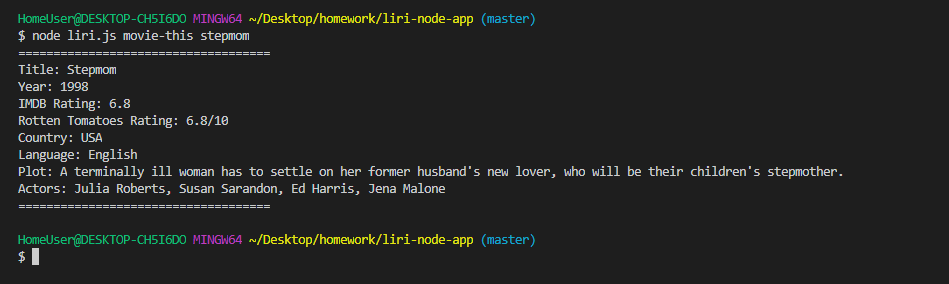
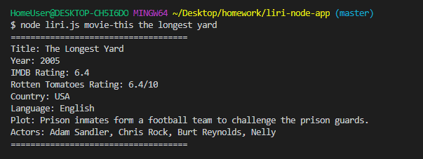
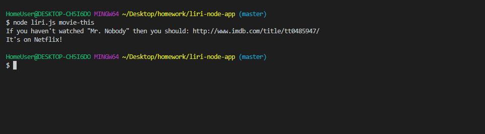
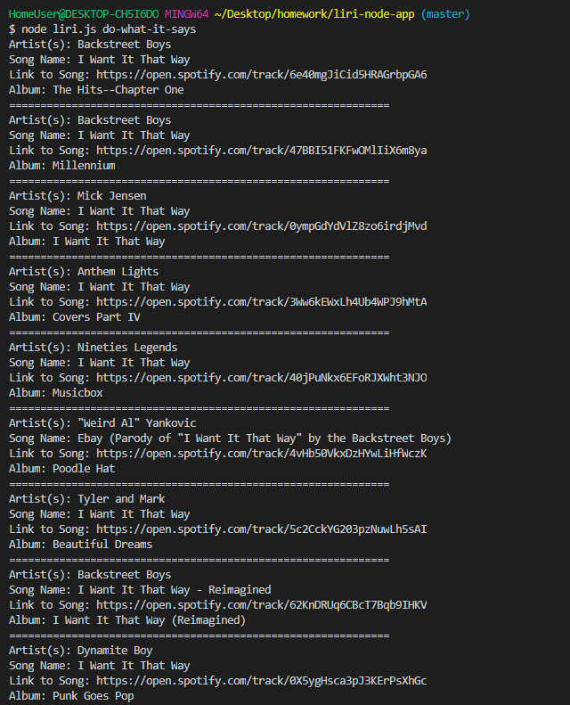
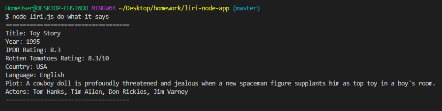

# liri-node-app

# LIRI APPLICATION #

The Liri application allows you to input the following commands with node.js.

* concert-this 
* spotify-this-song 
* movie-this 
* do-what-it-says 
  
  
 When you enter concert-this the application will access the Bands In Town API and return the tour details for the artist/band you entered. 
 
 The results will show:
 * Name of Venue
 * Venue Location
 * Date of Event
 
 
 
 The band/artist can be more than one word.
 
 
  
  
 If you do not enter in an artist/band name you will recieve the message below.
 
 

 
 
 
 When you enter spotify-this-song the application will access the Spotify API and return details on the song that was searched.
 
 The results will show:
 
 * Artist(s)
 * The song's name
 * A preview link of the song from Spotify
 * The album the song is from 
 
 
 
 The song name can have multiple words.
 
 
 
 If you do not enter a song, the default song will return information for Ace of Base song "The Sign"
 
 
  
  
  When you enter movie-this the application will access the OMDB API and return information about the movie name entered.
  
  The results will show:
  
   * Title of the movie.
   * Year the movie came out.
   * IMDB Rating of the movie.
   * Rotten Tomatoes Rating of the movie.
   * Country where the movie was produced.
   * Language of the movie.
   * Plot of the movie.
   * Actors in the movie.
   
   

The movie name can include multiple words. 

If you do not enter in a movie name the following message will show.

The last command the application takes is do-what-you-say. The do-what-you-say command will access the text file and return the command saved in the file. 

 

Below is also a link to a video of the application in action!
https://drive.google.com/file/d/1xZaTekWFpqrngYYEdfw29_aJARolNh1Q/view

To try the application yourself, be sure to check the package.json file.

