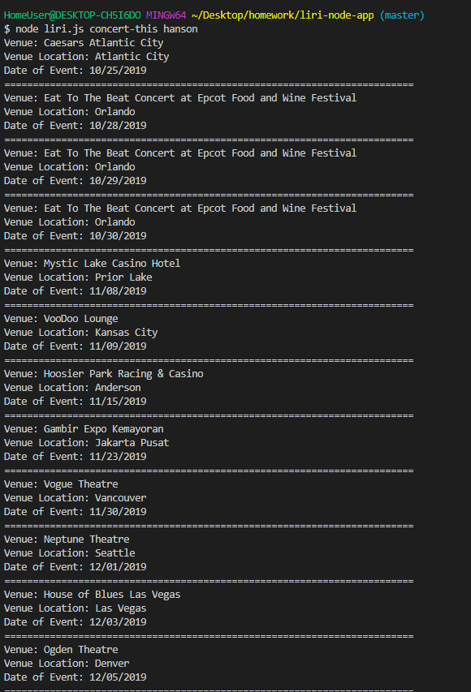

# liri-node-app

# LIRI APPLICATION #

The Liri application allows you to input the following commands with node.js.

* concert-this <artist/band name>
* spotify-this-song <song name>
* movie-this <movie name>
* do-what-it-says 
  
  
 When you enter in concert-this the application will access the Bands In Town API and return the tour details for the artist/band you entered. 
 
 

 

https://drive.google.com/file/d/1xZaTekWFpqrngYYEdfw29_aJARolNh1Q/view
